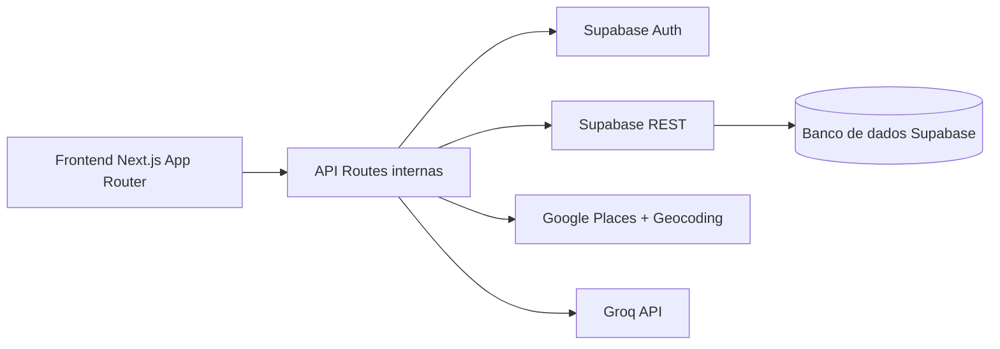

# AllProspect

Plataforma de prospecção e CRM operacional para equipes comerciais B2B.

O AllProspect centraliza busca de empresas, qualificação de leads, gestão do funil e assistência com IA em um único fluxo de trabalho.

[](https://nextjs.org/)
[](https://www.typescriptlang.org/)
[](https://supabase.com/)
[](https://vercel.com/)

Repositório: https://github.com/jailsonsntn/prospecaogeral.git

## Sumário

- [Problema que resolve](#problema-que-resolve)
- [Principais funcionalidades](#principais-funcionalidades)
- [Arquitetura da solução](#arquitetura-da-solucao)
- [Stack e serviços](#stack-e-servicos)
- [Estrutura do projeto](#estrutura-do-projeto)
- [Configuração de ambiente](#configuracao-de-ambiente)
- [Como rodar localmente](#como-rodar-localmente)
- [Banco de dados (Supabase)](#banco-de-dados-supabase)
- [Fluxo de uso no dia a dia](#fluxo-de-uso-no-dia-a-dia)
- [Deploy na Vercel](#deploy-na-vercel)
- [Checklist de produção](#checklist-de-producao)
- [Scripts](#scripts)
- [Segurança](#seguranca)
- [Roadmap sugerido](#roadmap-sugerido)

## Problema que resolve

Times comerciais costumam operar com ferramentas separadas para:

- Encontrar empresas
- Organizar contatos
- Priorizar follow-up
- Produzir mensagens e tarefas

O AllProspect une essas etapas em uma única experiência:

- Captura por CNPJ e Google Maps
- Funil visual em Kanban
- Rotina de execução comercial
- Apoio de IA para acelerar ação

## Principais funcionalidades

### Prospecção CNPJ

- Consulta unitária com visão detalhada da empresa
- Pesquisa avançada com filtros combinados
- Processamento em lote
- Marcação rápida de lead para envio ao CRM

### Prospecção por mapa (Google)

- Busca por raio (GPS ou local manual)
- Busca por cidade, bairro ou região
- Filtros por telefone, site e redes sociais
- Exportação CSV (todos ou selecionados)
- Envio imediato de resultado para o CRM

### CRM operacional

- Pipeline em Kanban com arrastar e soltar
- Modos de visualização e filtros avançados
- Atualização de status, prioridade e canal
- Detalhe do lead sob demanda

### Central de IA

- Resumo comercial do lead
- Sugestão de abordagem inicial
- Priorização com justificativa
- Geração de tarefas e apoio de conteúdo

### Sessão e autenticação

- Login com Supabase Auth
- Guardas de rota autenticada
- Timeout por inatividade com aviso prévio

## Arquitetura da solução



### Fluxo simplificado

1. Usuário autentica no sistema
2. Faz prospecção por CNPJ ou mapa
3. Converte resultado em lead
4. Move lead no funil do CRM
5. Usa IA para acelerar próximas ações

## Stack e serviços

| Camada | Tecnologia |
|---|---|
| Frontend | Next.js 16 (App Router), React 18, TypeScript |
| UI | Tailwind CSS |
| Auth | Supabase Auth |
| Dados | Supabase REST + migrações SQL |
| Mapa | Google Places API + Geocoding API |
| IA | Groq API |
| Deploy | Vercel |

## Estrutura do projeto

```text
app/
   ai/                  # Central de IA
   crm/                 # CRM operacional
   login/logout/        # Autenticação
   prospeccao-cnpj/     # Prospecção por CNPJ
   prospeccao-mapa/     # Prospecção por mapa
   api/                 # Endpoints internos (AI, Maps, Search)
components/            # Blocos de interface reutilizáveis
lib/                   # Regras de domínio e integrações
supabase/migrations/   # Estrutura e políticas do banco
docs/                  # Documentação complementar
```

## Configuração de ambiente

Copie `.env.example` para `.env.local` e preencha:

| Variável | Obrigatória | Uso |
|---|---|---|
| NEXT_PUBLIC_SUPABASE_URL | Sim | URL do projeto Supabase |
| NEXT_PUBLIC_SUPABASE_PUBLISHABLE_KEY | Sim | Chave pública para auth e REST |
| GOOGLE_MAPS_API_KEY | Sim | Busca de empresas e geocodificação |
| GROQ_API_KEY | Sim | Recursos de IA |

Boas práticas:

- Nunca versionar `.env.local`
- Não usar `service_role` no cliente
- Rotacionar chaves em caso de exposição

## Como rodar localmente

1. Instale dependências

```bash
npm install
```

2. Suba o ambiente local

```bash
npm run dev
```

3. Acesse

```text
http://localhost:3000
```

## Banco de dados (Supabase)

As migrações estão em `supabase/migrations`.

Ordem sugerida de execução:

1. `01_drop_tables.sql`
2. `02_create_tables.sql`
3. `03_indexes.sql`
4. `04_enable_rls_and_policies.sql`

## Fluxo de uso no dia a dia

1. Entrar no sistema
2. Prospectar por CNPJ ou mapa
3. Enviar registros para o CRM
4. Organizar no Kanban por estágio
5. Usar IA para resumo, resposta e tarefas
6. Executar follow-up com foco em conversão

## Deploy na Vercel

1. Garanta que o código está no GitHub
2. Na Vercel, clique em Add New Project
3. Importe `jailsonsntn/prospecaogeral`
4. Configure as variáveis de ambiente
5. Dispare o deploy

Configuração recomendada:

- Framework Preset: Next.js
- Build command: `npm run build`
- Install command: `npm install`
- Output directory: padrão Next.js

## Checklist de produção

- Variáveis configuradas na Vercel
- Supabase com schema e RLS aplicados
- APIs do Google habilitadas na chave
- Chave Groq ativa e com limite adequado
- Fluxos críticos testados em produção:
   - login/logout
   - CRM
   - prospecção CNPJ
   - prospecção mapa
   - módulo AI

## Scripts

```bash
npm run dev        # desenvolvimento com ajuste de memória
npm run dev:turbo  # alternativa com turbopack
npm run build      # build de produção
npm run start      # servidor de produção
```

## Segurança

- Headers de segurança definidos em `next.config.js`
- Geolocalização permitida apenas para o próprio domínio
- Controle de sessão com timeout por inatividade
- Limpeza de sessão no logout

## Roadmap sugerido

- Dashboard com métricas históricas por período
- Importador de listas CSV para enriquecimento automático
- Playbooks de cadência comercial por segmento
- Integração com canais externos (WhatsApp/API de e-mail)
